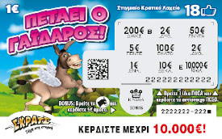
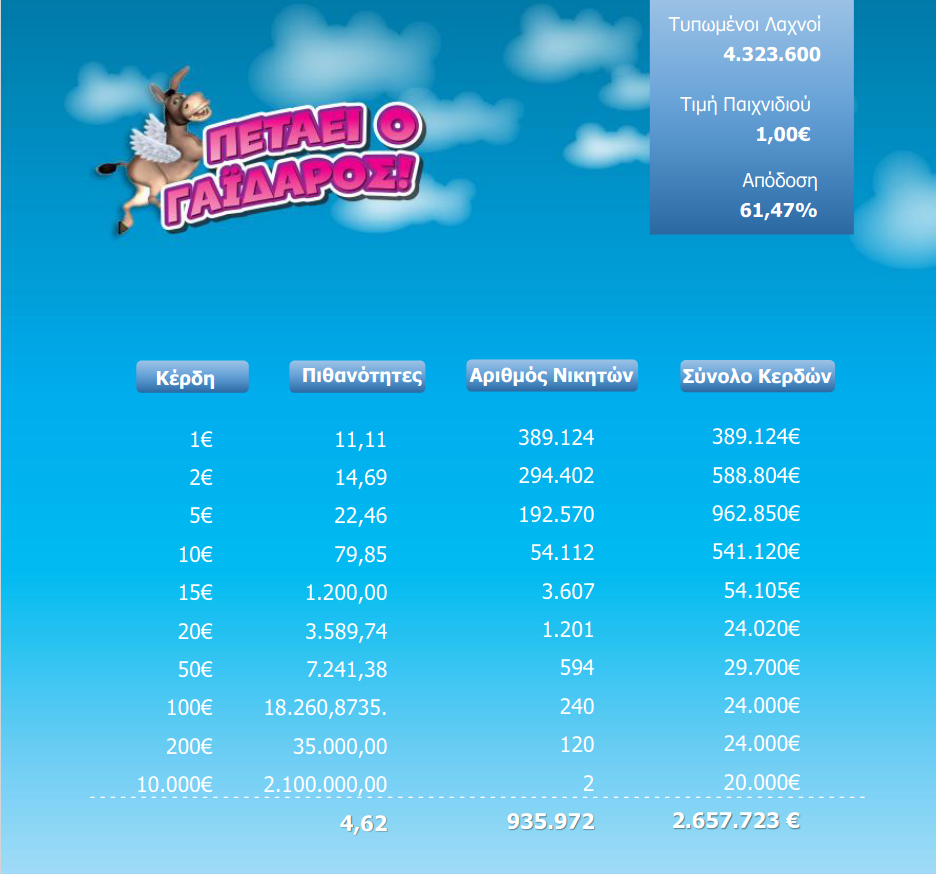

# Scratch ticket simulator

[Play here](https://vdassios.github.io/scratch/)

An online simulation of OPAP's [Flying Donkey](https://www.scratch.gr/en/index#petaeiogaidaros)

Everything was built from zero using only these two pngs

 

Generates an arbitrary amount of tickets, ranging from 4 to 4.5 million.
Offers user interactivity & automated playability while visualizing
all the data thus generated.

- Hover over the horse petals to reveal the prizes underneath.
- Find three of the same value & win the same amount in euros.
- Each ticket costs 1 euro.
- **Generate** a new ticket to play again, as many times as you want.
- Press the **simulate** button and the computer plays for you, one ticket per 5ms.
- Click on **final data** to see the end results for the given ticket series.

On each page reload a new ticket series prints a random amount of tickets between
4 and 4.5 million.

The bar chart plots each individual prizes' probability to occur, while the pie
chart tracks the % of tickets with a winning value occuring versus those that
simply lose. The chance to draw a winning ticket is roughly 21%.

You can see these values update in real time for a given ticket series
as you play manually, or by using the simulation button to simulate about
10000 ticket outcomes.
The final data button reveals the final tally of the whole series.

## Disclaimer

For educational use only.

The probability model is based on the following public data

