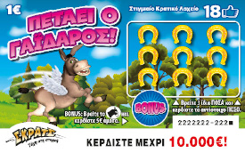

# Scratch ticket simulator

An online simulation of OPAP's [Flying Donkey](https://www.scratch.gr/en/index#petaeiogaidaros)

Everything was built from zero using only these two pngs

 

Generates an arbitrary amount of tickets, ranging from 4 to 4.5 million.
Offers user interactivity & automated playability while visualizing
all the data thus generated.

- Hover over the horse petals to reveal the prizes underneath.
- Find three of the same value & win the same amount in euros.
- Each ticket costs 1 euro.
- **Generate** a new ticket to play again, as many times as you want.
- Press the **simulate** button and the computer plays for you, one ticket per 5ms.
- Click on **final data** to see the end results for the given ticket series.

## Disclaimer

For educational use only.

The probability model is based on the following public data

